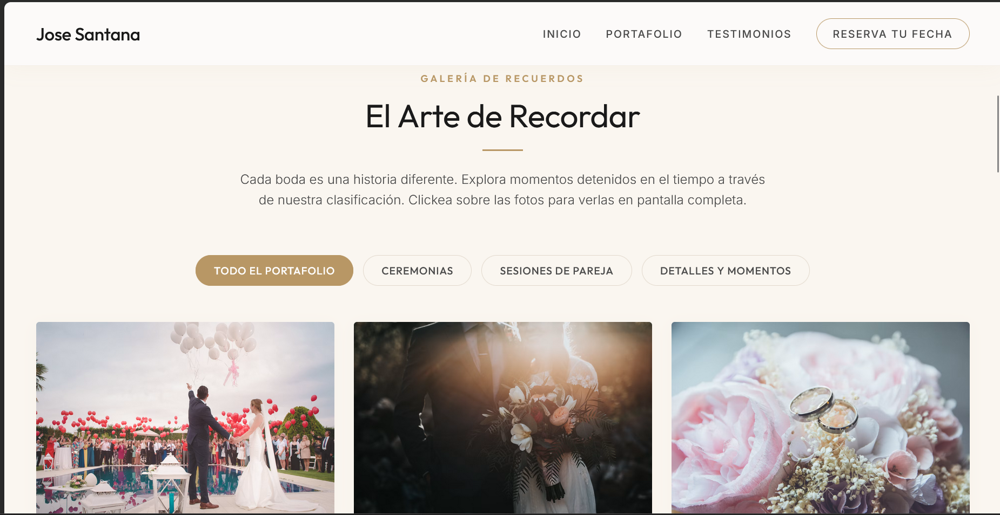
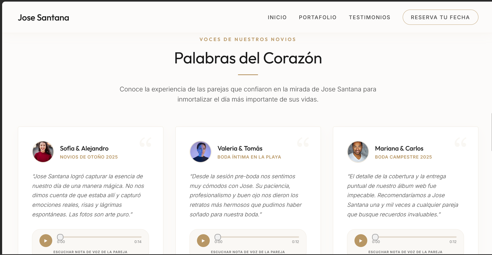
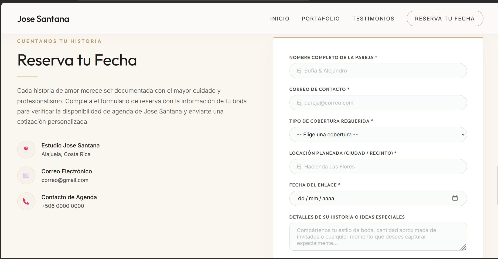

# Jose Santana - Fotografía de Bodas & Documental

Este repositorio contiene el código fuente de la **Landing Page Profesional de Fotografía de Bodas** para el fotógrafo **Jose Santana**. Es un desarrollo académico completo realizado en cumplimiento de los requisitos de la Opción 7 del proyecto universitario de desarrollo frontend.

La aplicación destaca por una estética minimalista, elegante y exclusiva (tonalidades champaña, marfil y bronce dorado) diseñada desde cero utilizando estándares web modernos, sin frameworks de estilos CSS o dependencias de validación externas.

---

## Tecnologías y Framework Utilizado

El proyecto está construido bajo los siguientes pilares de desarrollo:
*   **Framework Principal:** [React 19](https://react.dev/) - Biblioteca de JavaScript para la construcción de interfaces modulares basadas en componentes.
*   **Entorno y Empaquetador:** [Vite 8](https://vite.dev/) - Servidor de desarrollo ultrarrápido y compilador optimizado para producción.
*   **Hojas de Estilo:** **Vanilla CSS** (CSS Puro) - Sistema de diseño responsivo basado en CSS Flexbox, Grid, variables globales (`:root`) y animaciones `@keyframes` nativas sin dependencias externas (sin Bootstrap ni Tailwind).
*   **Gestión Multimedia:** HTML5 Video API y Web Audio API (utilizando referencias directas de React con `useRef`).

---

## Arquitectura de la Aplicación

El proyecto sigue una arquitectura modular en React estructurada de la siguiente manera:

```
├── public/
│   ├── datos.json         # Base de datos simulada (Fotos, categorías y testimonios)
│   ├── video-boda.mp4     # Video de fondo para la cabecera (Local en public)
│   ├── testimonio-1.mp3   # Audio del testimonio 1 (Nota de voz local)
│   └── ...
├── src/
│   ├── components/
│   │   ├── Hero.jsx       # Cabecera principal con video y scroll suave
│   │   ├── Galeria.jsx    # Portafolio categorizado con Lightbox nativo
│   │   ├── Testimonios.jsx# Tarjetas de testimonios con audio sincronizado
│   │   └── Formulario.jsx # Formulario controlado y validado manualmente
│   ├── App.jsx            # Componente raíz controlador (Fetch, estados y nav)
│   ├── index.css          # Estilos globales y variables de diseño
│   └── main.jsx           # Punto de entrada de renderizado en el DOM
└── index.html             # Estructura HTML, metas SEO y fuentes web
```

### Flujo de Datos Dinámicos
1.  Al montarse la aplicación, `App.jsx` ejecuta un hook `useEffect` que realiza una petición asíncrona `fetch()` al archivo estático `public/datos.json`.
2.  Los datos del portafolio se cargan en el estado local (`datos`). Durante la carga, se muestra una pantalla de carga animada en CSS.
3.  La información se distribuye a los componentes secundarios a través de **Props** (`imagenes={datos.galeria}` y `testimonios={datos.testimonios}`).

---

## Detalles del Sistema y Características Clave

### 1. Lightbox desde Cero con Eventos de Teclado
El visor emergente de imágenes en [Galeria.jsx](file:///c:/Users/CesarCM/Documents/Proyectos_Multi/Proyecto_Personal_C31592/src/components/Galeria.jsx) está implementado de forma nativa. Registra un `useEffect` cuando el visor está activo para capturar las pulsaciones de teclado globales:
*   `Escape`: Cierra el lightbox de forma inmediata.
*   `ArrowRight` / `ArrowLeft`: Navega de forma circular por el set de imágenes filtrado de forma activa.

### 2. Reproductor de Audio Sincronizado
En [Testimonios.jsx](file:///c:/Users/CesarCM/Documents/Proyectos_Multi/Proyecto_Personal_C31592/src/components/Testimonios.jsx), cada recién casado posee una nota de voz. Para evitar la superposición molesta de audios:
*   Se eleva el estado a `App.jsx` mediante un ID activo (`idAudioActivo`).
*   Si una tarjeta inicia su reproducción, envía su ID al padre, obligando a las demás tarjetas de testimonios a recibir un estado de pausa y detener sus nodos `<audio>` correspondientes a través de su referencia `useRef`.

### 3. Formulario Controlado y Validaciones Rigurosas
El archivo [Formulario.jsx](file:///c:/Users/CesarCM/Documents/Proyectos_Multi/Proyecto_Personal_C31592/src/components/Formulario.jsx) utiliza estados individuales para controlar los valores ingresados:
*   **Validación en tiempo real:** Los eventos `onChange` y `onBlur` ejecutan una validación por campo para alertar al usuario antes de enviar.
*   **Formatos y RegEx:** El correo se valida mediante expresiones regulares detalladas.
*   **Restricción de Fechas:** La fecha de reserva del evento se restringe de forma dinámica con `min={hoy}` para impedir reservas en fechas pasadas.

---

## Guía de Instalación y Ejecución

Sigue estos pasos en tu consola de Windows (Powershell) para inicializar el proyecto:

### 1. Clonar o descargar el repositorio
```powershell
cd c:\TuRutaDeProyectos
git clone https://github.com/CesarCM19/Proyecto_Personal_C31592.git
cd Proyecto_Personal_C31592
```

### 2. Instalar dependencias del proyecto
Instala los paquetes necesarios definidos en el `package.json` (React y Vite):
```powershell
npm install
```

### 3. Iniciar el servidor local de desarrollo
Lanza la aplicación en modo desarrollo con HMR activo:
```powershell
npm run dev
```
*Abre tu navegador en [http://localhost:5173](http://localhost:5173) para ver la interfaz en tiempo real.*

### 4. Compilar para producción
Genera el paquete optimizado y minificado en la carpeta `/dist`:
```powershell
npm run build
```

---

## Capturas de Pantalla

### 1. Vista General de Escritorio


### 2. Portafolio de Bodas y Visor Lightbox Activo


### 3. Sección de Testimonios


### 4. Sección de Reservación personalizada

